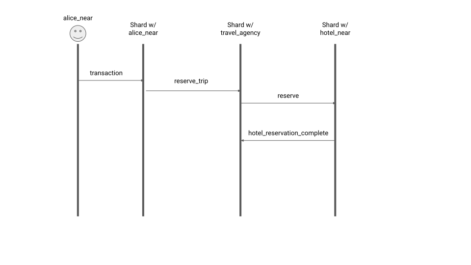

# Llamado cross-contrato

Esta guía asume que ya leíste la sección [Transacciones Financieras](FinancialTransaction.md).

Supongamos que Alices está llamando a una función `reserve_trip(city: String, date: u64)` en un contrato inteligente desplegado en una
cuenta llamada `travel_agency` que a su vez llama a `reserve(date: u64)` en un contrato inteligente desplegado en otra cuenta llamada `hotel_near` y liga
un método callback al método `hotel_reservation_complete(date: u64)` en `travel_agency`.



## Pre-requisitos

Alices puede llamar a `travel_agency` de varias maneras diferentes.

En el escenario más simple Alice tiene una cuenta `alice_near` y tiene una llave de acceso completo.
Desoués ella crea la siguiente transacción que llama a `travel_agency`:

```
Transaction {
    signer_id: "alice_near",
    public_key: "ed25519:32zVgoqtuyRuDvSMZjWQ774kK36UTwuGRZMmPsS6xpMy",
    nonce: 57,
    receiver_id: "travel_agency",
    block_hash: "CjNSmWXTWhC3EhRVtqLhRmWMTkRbU96wUACqxMtV1uGf",
    actions: vec![
        Action::FunctionCall(FunctionCallAction {
            method_name: "reserve_trip",
            args: "{\"city\": \"Venice\", \"date\": 20191201}",
            gas: 1000000,
            tokens: 100,
        })
    ],
}
```

Aquí la llave pública corresponde a la llave de acceso completo de la cuenta `alice_near`. Todos los otros campos en `Transaction` se
analizaron más a fondo en la sección [Financial Transaction](FinancialTransaction.md). La acción `FunctionCallAction` describe como
el contrato debe de ser llamado. El campo `receiver_id` en `Transaction` ya establece cuál contrato debe de ser ejecutado,
`FunctionCallAction` simplemente describe como debería de ser ejecutado. Curiosamente, los argumentos son solo un blob de bytes,
le corresponde al desarrolador del contrato cuál formato de serialización escoge para sus argumentos. En este ejemplo, el desarrollador
del contrato ha escogido usar JSON, entonces se espera que la herramienta que Alice use para crear esta transacción use JSON también
para pasar los argumentos. `gas` declara cuánto gas `alice_near` ha prepagado para las tarifas calculadas dinámicamente de las ejecuciones del
contrato inteligente y otras acciones que esta transacción pueda crear. Los `tokens` son el monto que `alice_near` agrega
para ser depositado a cualquier contrato inteligente que esté llamando. Note que, el `gas` y los `tokens` están en diferentes unidades de
medición.

Ahora, considere un escenario un poco más complejo. En este escenario Alice usa una llave de acceso restringida para llamar a esta función.
Esto es que el permiso de esta llave de acceso no es `AccessKeyPermission::FullAccess` y por el contrario el permiso es: `AccessKeyPermission::FunctionCall(FunctionCallPermission)` donde

```
FunctionCallPermission {
    allowance: Some(3000),
    receiver_id: "travel_agency",
    method_names: [ "reserve_trip", "cancel_trip" ]
}
```

Este escenario podría surgir cuando algún padre de Alice le dió un acceso restringido a la cuenta `alice_near` al
crear una clave de acceso que se puede utilizar estrictamente para la gestión de viajes.
Esta llave de acceso permite hasta `3000` tokens para ser gastados (que incluye transferencias de tokens y pagos por gas), solo puede
ser usado para llamar a `travel_agency` y solo puede ser usado con los métodos `reserve_trip` and `cancel_trip`.
La manera en que el tiempo de ejecución maneja este caso es casi exactamente igual al pasado, con la única diferencia en como verifica
la firma en la transacción firmada, y que además revisa el allowance para que no sea excedido.

Finalmente, en el último escenario, Alice no tiene una cuenta (o la existencia de `alice_near` es irrelevante). Sin embargo,
alice tiene una llave de acceso completo o restringido directamente en la cuenta `travel_agency`. En ese caso `signer_id == receiver_id` en
el objeto `Transaction` y el tiempo de ejecución convertirá la transacción en el primer recibo y aplicará ese recibo en el mismo bloque.

Esta sección se enfocará en el primer escenario, dado que los otros dos son lo mismo con algunas diferencias menores.

## Transacción a recibo

El proceso de convertir una transacción a un recibo es muy similar a la [Transacción Financiera](FinancialTransaction.md)
con varios puntos clave a notar:

- Como alice liga 100 tokens a la llamada de función, los restamos de `alice_near` al convertir la transacción en recibo,
  similar a la transacció financiera regular;
- Como estamos agregando 1000000 de gas prepagado, no solo restaremos el costo del gas por el procesamiento del recibo de `alice_near`,
  sino que también se comprará 1000000 de gas usando el precio de gas actual.

## Procesando el recibo `reserve_trip`

El recibo creado en el fragmento que aloja a `alice_near` eventualmente llegará al fragmento que aloja a la cuenta `travel_agency`.
Será procesado en `Runtime::apply` que revisará que el recibo no tenga dependencias de datos (que es el caso porque esta llamada
de función no es un método callback) y llamará a `Runtime::apply_action_receipt`.
En este punto el procesamiento del recibo es similar al procesamiento de recibos que se ve en la sección [Transacciones Financieras](FinancialTransaction.md),
con la diferencia de que aquí llamaremos a `action_function_call` y este hará lo siguiente:

- Recuperar el código Wasm del contrato inteligente (puede ser de la base de datos o del cache);
- Inicializa el contexto de tiempo de ejecución `VMContext` y crea `RuntimeExt` que provee el acceso al trie cuando el contrato inteligente
  llama al API del almacenamiento. Específicamente los argumentos `"{\"city\": \"Venice\", \"date\": 20191201}"` serán establecidos en `VMContext`.
- Llama a `near_vm_runner::run` que hace lo siguiente:
  - Inyecta gas, pilas y otras formas de medición;
  - Verifica que el código Wasm no usa valores flotantes;
  - Revisa que los enlaces de funciones API que el contrato inteligente está tratando de llamar son aquellos que `near_vm_logic` proporcionó;
  - Compila el código Wasm a un binario nativo;
  - Llama a `reserve_trip` en el contrato inteligente.
    - Durante la ejecución del contrato inteligente, en algún punto, se llamará a `promise_create` y a `promise_then`, que llamará
      al método en `RuntimeExt` que registrará esas dos promesas fueron creadas y que la segunda debe
      esperar a la primera. Específicamente, `promise_create` llamará a `RuntimeExt::create_receipt(vec![], "hotel_near")`
      regresando `0` y después a `RuntimeExt::create_receipt(vec![0], "travel_agency")`;
- Después `action_function_call` recolecta los recibos de `VMContext` junto con el resultado de la ejecución, logs e información
  del gas usado;
- Luego `apply_action_receipt` repasa los recibos recolectados de cada acción y los regresa al final de `Runtime::apply` junto con
  otros recibos.

## Procesando el recibo `reserve`

Este recibo tendrá `output_data_receivers` con un elemento que corresponde al recibo que llama a `hotel_reservation_complete`,
que le dirá al tiempo de ejecución que debe de crear un `DataReceipt` y enviarlo hacia `travel_agency` una vez que la ejecución de `reserve(date: u64)` fue completada.

El resto de la ejecución del contrato inteligente es similar a la anterior.

## Procesando el recibo `hotel_reservation_complete`

Al recibir el recibo `hotel_reservation_complete` el tiempo de ejecución notará que su `input_data_ids` no está vacío
lo que significa que no puede ser ejecutado hasta que el recibo `reserve` sea completado. El recibo será guardado en el trie junto
con el contador de cuantos `DataReceipt` está esperando.

En este punto no llamará al contrato inteligente Wasm.

## Procesando el `DataReceipt`

Una vez que el tiempo de ejecución recibe el `DataReceipt`, toma el recibo con la llamada de función `hotel_reservation_complete`
y ejecuta siguiendo los mismos pasos de ejecución que el recibo `reserve_trip`.
